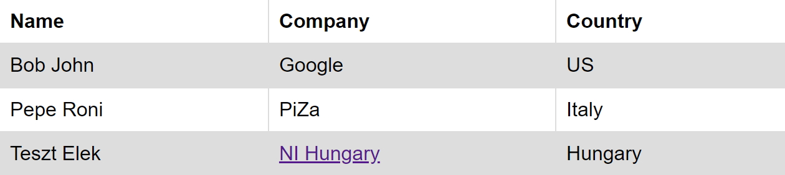

A DSL (Domain Specific Language) for Selenium Test Automation
===========
# Table of contents
- [About](#about)
- [Prerequisites](#Prerequisites)
- [Configuration setup](#configuration-setup)
- [Environment variables](#environment-variables)
- [Structure of testcases](#structure-of-testcases)
- [Running the script](#running-the-script)
- [List of commands](#list-of-commands)
- [How to find HTML element selectors](#finding-html-selectors)
- [Example inputs](#example-inputs)
- [Limitations](#limitations)
- [Troubleshooting](#troubleshooting)

## About
This is a simple language to automate browser test without writing any python. The language lexer and parser is generated by [Antlr](https://www.antlr.org).

## Prerequisites

1. Install the latest version of Python 3 for all users

2. From a command line (e.g. PowerShell, CMD, etc.) install the following:
```
	pip install selenium
	pip install antlr4-python3-runtime
	pip install colorama
```
3. Download a webdriver for the browser you want to perform the tests on.
   The webdriver version must match your browser version.

Webdriver download sites:

- [Microsoft Edge](https://developer.microsoft.com/en-us/microsoft-edge/tools/webdriver/)
- [Google Chrome](https://chromedriver.chromium.org/downloads)
- [Firefox](https://github.com/mozilla/geckodriver/releases), scroll down to find the available versions.
    

## Configuration setup
Before running the script, please take some time to set up the config.json file.

The file setup is the following:

```
{
  "driverPath": "C:\\selenium_drivers\\msedgedriver.exe",
  "browser": "edge",
  "headless": false
}
```

- driverPath: path to the webdriver.
- browser: the browser we want to use:
  - edge: Microsoft Edge
  - firefox: Mozilla Firefox
  - chrome: Google Chrome
- headless: if set to true, the test cases will run in the background, the browser windows will not be visible during execution
***

## Environment variables
It is possible to reference values from the env.json file in the testcases. To do this, put a *$* before the variable name in a test file.

Example env.json file:

```
{
  "USERNAME": "My username",
  "PASSWORD": "My password",
  "YOUTUBE_INPUT": "hi mom!"
}
```

Example value referencing from test file:

```
begin
   open "https://urlofsomesite.com"
   type $USERNAME into "username_input" by id
   type $PASSWORD into "password_input" by id
end
```
***

## Structure of testcases
Each testcase begins with an optional name declaration. After this comes the **begin** keyword, statements, then the **end** keyword.

To better understand, let's see an example:

```
('first testcase')
begin
   open "https://google.com"
end

('second testcase')
begin
   open "https://youtube.com"
end

begin
   open "https://twitter.com"
end
```

Running the testcases above will produce an output like the following:

```
('first testcase'): PASSED
('second testcase'): PASSED
test case 3: PASSED

========================= 3 PASSED =========================
========================= 0 FAILED =========================
=========================3 Total in 7.292 s ==========================
```

If a name is not provided, the default name will be "test case #", where # is the number of testcases already run.

***
## Running the script
From a terminal, go into the [dsl](selenium_test_dsl/dsl) folder 
```
cd C:\git\mfg-rnd-es-ta\web-checks\DSeLenium\selenium_test_dsl\other_dsl

python app_runner.py <optional path to custom dsl test file>
```


## List of commands
- [Open url](#open-url)
- [Selecting an HTML element](#selecting-an-html-element)
- [click](#click)
- [type](#type)
- [screenshot](#screenshot)
- [sleep](#sleep)
- [assert](#assert)
- [dropdown select](#dropdown-select)
- [table click](#table-click)


### Open URL

***
### Selecting an HTML element
Most commands require you to specify the element you want to perform the action on.
To do this, specify the selector text between quotes, then the selector type:
```
    <SELECTOR TEXT> by <SELECTOR TYPE>
```
#### List of selectors
- id : by html id attribute
- name: by html name attribute
- css : by list of css selectors
- xpath: by xpath

Examples:
 ```
    'LOGIN_BUTTON' by id
    'LOGIN_BUTTON' by name
    '/html/body/h1' by xpath
    'body > h1:nth-child(1)' by css
```
#### finding html selectors

***
### Click
Clicks on an element.

Usage:
```
    click <SELECTOR TEXT> by <SELECTOR TYPE>
    click <SELECTOR TEXT> by <SELECTOR TYPE> <in # s>
```
Example:
``` 
    click 'LOGIN_BUTTON' by id
    click 'LOGIN_BUTTON' by name
```
***
### Type

Types the given text into the element.

Usage:
```    
    type <TEXT> into <SELECTOR TEXT> by <SELECTOR TYPE>
    type <TEXT> into <SELECTOR TEXT> by <SELECTOR TYPE> <in # s>
```
Example:
```
    type "python selenium basic" into "search_bar" by id
    type "python selenium basic" into "search_bar" by id in 3 s
```
***
### Screenshot
Takes a screenshot with the name specified.
If the name is not specified, a default name is used: screenshot_#.png, where # is the number of screenshots taken so far without names.

Example:
```
    screenshot 'apex_test.png'
    screenshot
```
***
### Sleep
Completely stops the test execution for the given amount of seconds.

Usage:
```
    sleep # s
```
Example:
``` 
    sleep 5 s
```
***
### Assert
Checks if some condition is true. Useful when checking if some action was successful, for example logging in into a site.

List of asserts:
- [assert text of element](#assert-text-of-element)
- [assert page title](#assert-page-title)
- [assert element is clickable](#assert-element-is-clickable)
- [assert element is visible](#assert-element-is-displayed)
- [assert element is selected](#assert-element-is-selected)

###  Assert text of element
Checks if the text of an element is equal to something.

Usage:
``` 
    assert text of  <SELECTOR TEXT> by <SELECTOR TYPE> is <TEXT_VALUE>
```
It is possible to negate the assertion,
that is we can assert that the element value is not equal to something

Usage:
```
    assert text of  <SELECTOR TEXT> by <SELECTOR TYPE> is not <TEXT_VALUE>
```

When asserting the input text of elements, such as search bars, etc. the following should be used:
```
    assert input text of  <SELECTOR TEXT> by <SELECTOR TYPE> is <TEXT_VALUE>
```

***
### Assert page title

Checks if the title of the current page is equal to something.

Usage:
```
    assert page title is <TEXT_VALUE>
```
Example:
```
    assert page title is "APEX Home"
```
***
###  Assert element is clickable
Checks an element is clickable.

Usage:
``` 
    assert <SELECTOR TEXT> by <SELECTOR TYPE> is clickable
```
It is possible to negate the assertion,
that is we can assert that the element value is not clickable

Usage:
```
    assert <SELECTOR TEXT> by <SELECTOR TYPE> is not clickable
```

***
###  Assert element is displayed
Checks an element is displayed.

Usage:
``` 
    assert <SELECTOR TEXT> by <SELECTOR TYPE> is displayed
```
It is possible to negate the assertion,
that is we can assert that the element value is not displayed

Usage:
```
    assert <SELECTOR TEXT> by <SELECTOR TYPE> is not displayed
```


***
###  Assert element is selected
Checks an element is selected.

Usage:
``` 
    assert <SELECTOR TEXT> by <SELECTOR TYPE> is selected
```
It is possible to negate the assertion,
that is we can assert that the element value is not selected

Usage:
```
    assert <SELECTOR TEXT> by <SELECTOR TYPE> is not selected
```


***
### Dropdown select
Selects an element from a dropdown menu.

Usage:
```
    from <SELECTOR TEXT> by <SELECTOR TYPE> select <VALUE>
```
Example:
```
    from 'cars' by id select 'Audi'
```
***

### Table click
Clicks a cell from a table.
This command is useful when dealing with dynamic tables, or when a table filter is not provided

Limitations:

- Currently, it does not work if there are more than 1 tables on a page.
- If no table header cells are used in the table.

Usage:

```
   click cell "HEADER" from table where "HEADER2" = "VALUE"
```


Example:

Given the following table



Let us click the "NI Hungary" cell:

```
    click cell "Company" from table where "Country" = "Hungary"
    click cell "Company" from table where "Company" = "NI Hungary"
```


***

## Example inputs
For complete example test files see the [example input files](selenium_test_dsl/resources/example_inputs)

***
## Limitations

As of right now the language cannot deal with:

- popup windows
- changing between multiple windows
- selecting multiple elements and performing actions on them


## Troubleshooting

- If there are selenium import errors, try to reinstall:
```
python -m pip install selenium --upgrade --force-reinstall
```

- Check if you have downloaded the right webdriver for your browser.

