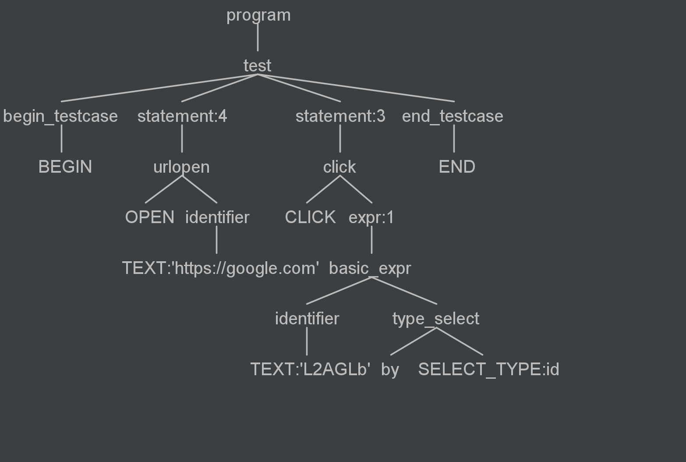

Table of contents
==
- ### [How the language works](#how-the-language-works)

- ### Modifying the language


## How the language works
To understand how everything works, let's look at an example input.
```
begin
    open 'https://google.com'
    click 'L2AGLb' by id 
end
```

The input file above produces a tree structure:


The [Visitor](../../generated/src/autodslVisitor.py) python class generated by Antlr takes this tree,
and traverses it in the order you see it, visiting each node in the process.

To make our language actually do something, we have to make a subclass of this Visitor class,
and implement each functionality when visiting certain nodes.

**It is important to note that these languages are NOT bound to a certain technology,
that is we could take this language, and use another automation tool beside selenium.**

## Modifying the language
To modify the language just make a subclass of the [Visitor](../../generated/src/autodslVisitor.py)
providing your implementation.